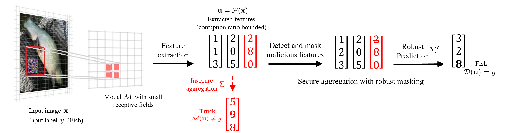

# PatchGuard: A Provably Robust Defense against Adversarial Patches via Small Receptive Fields and Masking
By [Chong Xiang](http://xiangchong.xyz/), [Arjun Nitin Bhagoji](http://www.princeton.edu/~abhagoji/), [Vikash Sehwag](https://vsehwag.github.io/), [Prattek Mittal](https://www.princeton.edu/~pmittal/)

Code for "[PatchGuard: A Provably Robust Defense against Adversarial Patches via Small Receptive Fields and Masking](https://www.usenix.org/conference/usenixsecurity21/presentation/xiang)" in USENIX security 2021 [arXiv Technical Report](https://arxiv.org/abs/2005.10884)



Update 04/2022: Check out our new [PatchCleanser](https://github.com/inspire-group/PatchCleanser) defense (USENIX Security 2022), our [paper list for adversarial patch research](https://github.com/xiangchong1/adv-patch-paper-list), and [leaderboard for certifiable robust image classification](https://github.com/inspire-group/patch-defense-leaderboard) for fun!

Update 12/2021: fixed incorrect lower bound computation for the true class when the detection threshold T>0. Thank [Linyi Li](https://github.com/llylly) for pointing that out! The mistake does not affect the main results of paper (since the main results are obtained with T=0).

Update 08/2021: started to work on a paper list for adversarial patch research [(link)](https://github.com/xiangchong1/adv-patch-paper-list).

Update 05/2021: included code (`det_bn.py`) for "[PatchGuard++: Efficient Provable Attack Detection against Adversarial Patches](https://arxiv.org/abs/2104.12609)" in Security and Safety in Machine Learning Systems Workshop at ICLR 2021.

## Requirements
The code is tested with Python 3.8 and PyTorch 1.7.0. The complete list of required packages are available in `requirement.txt`, and can be installed with `pip install -r requirement.txt`. The code should be compatible with other versions of packages.

## Files
```shell
├── README.md                        #this file 
├── requirement.txt                  #required package
├── example_cmd.sh                   #example command to run the code
├── mask_bn.py                       #PatchGuard: mask-bn for imagenet/imagenette/cifar 
├── mask_ds.py                       #PatchGuard: mask-ds/ds for imagenet/imagenette/cifar
├── det_bn.py                        #PatchGuard++: provable robust attack detection
├── nets
|   ├── bagnet.py                    #modified bagnet model for mask-bn
|   ├── resnet.py                    #modified resnet model 
|   ├── dsresnet_imgnt.py            #ds-resnet-50 for imagenet(te)
|   └── dsresnet_cifar.py            #ds-resnet-18 for cifar
├── utils
|   ├── defense_utils.py             #utils for different defenses
|   ├── normalize_utils.py           #utils for normalize images stored in numpy array (not used in the paper)
|   ├── cutout.py                    #utils for CUTOUT training (not used)
|   └── progress_bar.py              #progress bar (used in train_cifar.py; unnecessary though)
| 
├── misc                             #useful scripts (but not used in robustness evaluation); move them to the main directory for execution
|   ├── test_acc.py                  #test clean accuracy of resnet/bagnet on imagenet/imagenette/cifar; support clipping, median operations
|   ├── train_imagenet.py            #train resnet/bagnet for imagenet
|   ├── train_imagenette.py          #train resnet/bagnet for imagenette
|   ├── train_cifar.py               #train resnet/bagnet for cifar
                                     #NOTE: The attack scripts are not used in our defense evaluation! 
|   ├── patch_attack.py              #empirically (untargeted) attack resnet/bagnet trained on imagenet/imagenette/cifar
|   ├── PatchAttacker.py             #utils for untargeted adversarial patch attack 
|
├── data   
|   ├── imagenet                     #data directory for imagenet
|   ├── imagenette                   #data directory for imagenette
|   └── cifar                        #data directory for cifar
|
└── checkpoints                      #directory for checkpoints
    ├── README.md                    #details of each checkpoint
    └── ...                          #model checkpoints
```
## Datasets
- [ImageNet](http://www.image-net.org/) (ILSVRC2012)
- [ImageNette](https://github.com/fastai/imagenette) ([Full size](https://s3.amazonaws.com/fast-ai-imageclas/imagenette2.tgz))
- [CIFAR-10](https://www.cs.toronto.edu/~kriz/cifar.html)

## Usage
- See **Files** for details of each file. 
- Download data in **Datasets** to `data/`.
- (optional) Download checkpoints from Google Drive [link](https://drive.google.com/drive/folders/1u5RsCuZNf7ddWW0utI4OrgWGmJCUDCuT?usp=sharing) and move them to `checkpoints`.
- See `example_cmd.sh` for example commands for running the code.

If anything is unclear, please open an issue or contact Chong Xiang (cxiang@princeton.edu).

## Related Repositories
- [certifiedpatchdefense](https://github.com/Ping-C/certifiedpatchdefense)
- [patchSmoothing](https://github.com/alevine0/patchSmoothing)
- [bag-of-local-features-models](https://github.com/wielandbrendel/bag-of-local-features-models)

## Citations

If you find our work useful in your research, please consider citing:

```tex
@inproceedings{xiang2021patchguard,
  title={PatchGuard: A Provably Robust Defense against Adversarial Patches via Small Receptive Fields and Masking},
  author={Xiang, Chong and Bhagoji, Arjun Nitin and Sehwag, Vikash and Mittal, Prateek},
  booktitle = {30th {USENIX} Security Symposium ({USENIX} Security)},
  year={2021}
}

@inproceedings{xiang2021patchguard2,
  title={PatchGuard++: Efficient Provable Attack Detection against Adversarial Patches},
  author={Xiang, Chong and Mittal, Prateek},
  booktitle = {ICLR 2021 Workshop on Security and Safety in Machine Learning Systems},
  year={2021}
}

```


